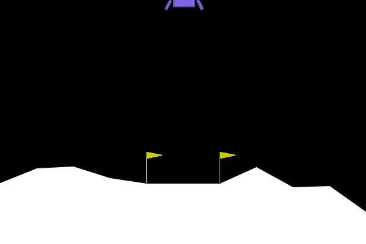

# MY LunarLander: An OpenAI Gymnasium and PyTorch-based project

MY LunarLander is a simplified Python project that teaches how to use OpenAI's Gymnasium and PyTorch to train a reinforcement learning agent to land a lunar module. This project uses a QNetwork to model the agent's learning process and is designed to be easy to understand, modify, and run. The project addresses the problem of outdated projects and fast API changes by providing a code that is compatible with current APIs and requires minimal changes for execution.




## Table of Contents

- [Requirements](#requirements)
- [Installation](#installation)
- [Project Structure](#project-structure)


## Requirements

- Python 3.7+
- OpenAI Gym
- PyTorch
- NumPy

## Installation

1. Clone this repository:
```
https://github.com/pajuhaan/LunarLander/LunarLander.git
```

2. Create a virtual environment and activate it:

I highly recommend utilizing **Anaconda** + **PyCharm** for your Python projects!

What's Conda? Yes if you are just start Python read [this](#Conda in Python).


3. Install the required dependencies:
```
pip install -r requirements.txt
```


## Project Structure

- `Agent.py`: This file defines the neural network architecture, which includes the Actor (Policy) model. The agent learns the optimal policy using the QNetwork.
- `Learn.py`: This file initializes the environment, trains the agent, and saves the learned model as a checkpoint.
- `Runner.py`: This file loads the trained model checkpoint and plays the game using the learned agent.
- `Capture.py`: This file saves a video of the trained agent playing the game.

### Learn
This will save the learned model as a checkpoint file named `checkpoint.pth`.


### Runner
This will load the `checkpoint.pth` file and play the game using the learned model.

### Capturing a Video
This will save a video file of the trained agent playing the game.


Enjoy your LunarLander project and have fun learning reinforcement learning with OpenAI Gym and PyTorch!


## Conda in Python

Conda is a powerful cross-platform package manager and environment management system for Python and other programming languages. It was primarily developed for the Anaconda distribution, which is a popular distribution of Python and R programming languages for data science, machine learning, and scientific computing. Conda makes it easy to install packages and manage dependencies, as well as to create, export, and share isolated environments for different projects.

### Benefits of Conda

1. **Cross-platform compatibility**: Conda works seamlessly across Windows, macOS, and Linux, making it easy to manage packages and environments on different operating systems.
2. **Environment management**: Conda enables you to create isolated environments for different projects, ensuring that packages and dependencies do not conflict with one another. This is particularly useful when working with projects that require different versions of the same package.
3. **Reproducibility**: Conda makes it simple to share and reproduce environments by exporting and importing environment configurations, ensuring that your project can be easily set up by others.
4. **Large package ecosystem**: Conda includes an extensive collection of packages, including those related to data science, machine learning, and scientific computing, which can be easily installed and managed.
5. **Easy package installation**: Conda simplifies the process of installing packages by handling dependencies automatically and providing pre-built binary packages that save time and reduce the need for manual compilation.

To get started with Conda, you can download and install the Anaconda distribution, which includes Conda as well as a large collection of pre-installed Python packages. Visit the [Anaconda website](https://www.anaconda.com/products/distribution) to download the appropriate installer for your operating system and follow the installation instructions.


## Author
Pajuhaan


## License
BSD
